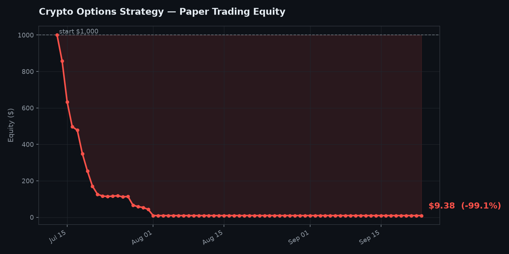

# Polymarket Crypto Options-Implied Bot

A fifth, independent bot. Instead of copying traders, watching insiders,
checking calibration, or modeling weather, this one borrows the pricing
intelligence of **professional crypto options traders** to spot mispriced
Polymarket crypto markets.



## The edge

Polymarket crypto markets ("Will Bitcoin be above $110k on June 30?") are
priced by a retail crowd. Deribit is where the world's professional crypto
options flow happens — billions in open interest, priced by sophisticated
traders. Deribit's implied volatility surface *is* the market's best
estimate of where BTC/ETH will be at any future date.

When Polymarket's price for "BTC above $X" disagrees with what Deribit's
options are implying for that exact strike and date, the options market is
usually the sharper number — so the gap is a tradeable signal.

## How it works

1. Pull Polymarket crypto threshold markets resolving within N days.
2. Parse the asset (BTC/ETH/SOL), strike price, direction (above/below),
   and target date from each market title.
3. Pull Deribit's current spot price and at-the-money implied volatility
   for the nearest matching expiry (free public API, no key).
4. Use Black-Scholes to compute the risk-neutral probability the asset
   finishes above/below the strike: `P(S_T > K) = N(d2)`.
5. Compare that options-implied probability to Polymarket's price; flag
   gaps larger than `--min-edge` (default 8 percentage points).

## Setup and usage

```bash
pip install requests matplotlib

# Scan only
python crypto_signals.py

# Full paper trader
python crypto_paper_trader.py
```

| Flag | Default | What it does |
|---|---|---|
| `--max-days` | 14 | markets resolving within this many days (crypto markets often run weekly+) |
| `--min-edge` | 0.08 | minimum \|options-implied − market\| to flag (8pp) |
| `--stake` | 20 | $ per paper position |
| `--max-open` | 20 | simultaneous position cap |

## Automated

`.github/workflows/crypto-daily.yml` runs daily at 7:00 UTC. Add a repo
secret `DISCORD_WEBHOOK_URL_CRYPTO` and trigger manually once to test.

## Honest limitations

- **ATM IV is an approximation.** The bot uses at-the-money implied
  volatility for the whole calculation. For strikes far from spot, the
  volatility *skew* (OTM options trade at different IVs) means the true
  options-implied probability differs from this estimate. A more precise
  version would interpolate IV at the specific strike, or read the
  probability directly off a call spread. This is a reasonable first
  approximation, not an exact risk-neutral density.
- **Zero-drift assumption.** The Black-Scholes calc assumes no drift,
  which is standard for short-horizon risk-neutral pricing but means very
  long-dated markets will be slightly off.
- **Expiry mismatch.** Deribit options expire on specific dates (usually
  Fridays); Polymarket markets resolve on arbitrary dates. The bot picks
  the *nearest* Deribit expiry, which introduces small timing error when
  they don't line up exactly.
- **Deribit ≠ Polymarket resolution source.** Deribit prices BTC via its
  own index; Polymarket may resolve against a different reference. For
  big round-number strikes this rarely matters, but it's not identical.
- **No fees/slippage modeled** — same caveat as every other bot.
- This is the most quantitatively sophisticated of the bots, which also
  means the most places for the model to be subtly wrong. Paper trade it
  for a good while before trusting it.
