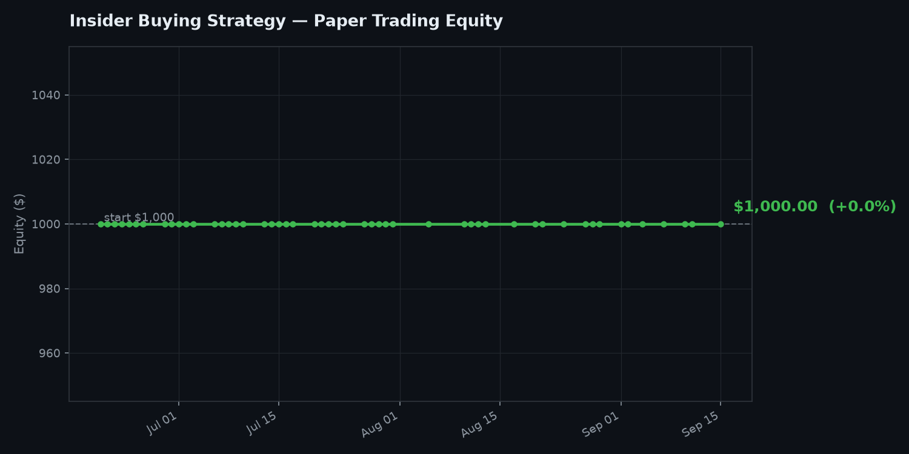

# SEC Insider Buying Signal Tracker + Paper Trader

A second, independent bot in this repo: instead of copying Polymarket's
top traders, this watches SEC filings for clusters of company insiders
(executives, directors, 10%+ owners) buying their own stock on the open
market, and paper-trades that signal so you can see if it actually works.

Same philosophy as the Polymarket bot: read-only, no real money, no
brokerage account, free official/public data sources only.



*Updated automatically every weekday by `chart.py` — see below.*

## Why this signal (briefly)

Insider *selling* is a weak signal — people sell for taxes, divorces,
buying a house, scheduled 10b5-1 plans, basic diversification. Insider
**buying** is different: it's voluntary, it's their own money, and
nobody is required to do it. A cluster of multiple insiders buying the
same stock around the same time is the more interesting case — it's a
studied effect in academic finance (Lakonishok & Lee 2001 and follow-on
work), not just a forum theory. Still not a guarantee — see the
limitations section at the bottom.

## Setup

```bash
pip install requests matplotlib
```

SEC requires a real, descriptive `User-Agent` on every request to EDGAR
(their fair-access policy — generic ones get rate-limited or blocked).
Set yours before running anything:

```bash
export SEC_USER_AGENT="Your Name your-email@example.com"
```

## 1. `insider_signals.py` — find the buy clusters

```bash
# Last 24h of Form 4 filings, any qualifying buy (even a single insider)
python insider_signals.py

# Stricter: require 2+ distinct insiders buying the same stock, $25k+ each
python insider_signals.py --min-insiders 2 --min-value 25000

# Save full results
python insider_signals.py --csv out.csv --json out.json
```

**How it works:** pulls SEC EDGAR's "latest filings" feed filtered to
Form 4, dedupes (each filing is listed once under the issuer and once
under the reporting owner), fetches each filing's structured XML
(`primary_doc.xml`), and keeps only transactions coded `P` (open-market
purchase) with shares *acquired* — option exercises, grants, gifts, and
sales are all excluded. Groups by ticker; ranks by how many distinct
insiders bought, then by total dollar value.

| Flag | Default | What it does |
|---|---|---|
| `--lookback-hours` | 24 | how far back to pull filings |
| `--min-insiders` | 1 | 2+ means "require a real cluster" |
| `--min-value` | 10000 | ignore buys below this $ value |
| `--show` | 15 | how many to print |
| `--csv` / `--json` | — | optional file output |

## 2. `insider_paper_trader.py` — track if it would actually make money

Opens a simulated position on each new qualifying ticker, holds for a
fixed period (default 30 calendar days — there's no natural "resolution"
like a Polymarket market, so this uses a fixed holding window instead),
then sells at the market price and records the result.

```bash
python insider_paper_trader.py                     # normal daily run
python insider_paper_trader.py --no-new-entries     # just check standings
python insider_paper_trader.py --hold-days 60 --stake 100   # longer hold, bigger size
```

Price data comes from [Stooq](https://stooq.com)'s free CSV endpoint —
unofficial and undocumented, but widely used and currently reliable. If
a ticker doesn't resolve (delisted, foreign listing, ticker change) the
script skips it with a warning rather than crashing. If Stooq's format
ever changes and prices stop resolving entirely, that's the first thing
to check.

| Flag | Default | What it does |
|---|---|---|
| `--starting-bankroll` | 1000 | simulated starting cash |
| `--stake` | 50 | $ size per new paper position |
| `--max-open` | 20 | cap on simultaneous open positions |
| `--hold-days` | 30 | calendar days held before auto-selling |
| `--min-insiders` | 2 | cluster strictness (2+ recommended) |
| `--min-value` | 25000 | ignore buys below this $ value |

## 3. Charting — reuses `chart.py` from the Polymarket bot

`chart.py` was built generic on purpose — point it at this bot's state
file and it works unmodified:

```bash
python chart.py --state-file insider_trades.json --out insider_equity_curve.png
```

The included workflow does this automatically every run.

## Running it daily (automated)

`.github/workflows/insider-tracker.yml` runs weekdays at 21:30 UTC
(~5:30pm ET, after market close), posts a summary to Discord, and
commits the updated state + chart back to the repo — same pattern as the
Polymarket bot.

**Setup:**

Repo → Settings → Secrets and variables → Actions → New repository secret
→ name it `SEC_USER_AGENT` → value `Your Name your-email@example.com`
(your real name/email — SEC actually checks this).

This bot posts to its **own** Discord channel, separate from the
Polymarket one — add a second repo secret named
`DISCORD_WEBHOOK_URL_INSIDER` with that channel's webhook URL (gear icon
on the channel → Integrations → Webhooks → New Webhook → Copy Webhook
URL). The workflow file already expects this secret name.

## Honest limitations

- **Fixed 30-day hold, not an informed exit.** Real insider-trading
  studies sometimes hold longer/shorter or scale out gradually. A flat
  30-day window is a simplification, not a researched optimum — easy to
  change via `--hold-days` once you have a few months of data to compare.
- **No fees, no slippage, no taxes modeled** — same caveat as the
  Polymarket bot.
- **Stooq is unofficial.** It's free and has no API key, which also
  means no SLA. If it goes down or changes format, prices stop updating
  until that's fixed.
- **Single reporting owner per filing.** Jointly-filed Form 4s (rare)
  only credit the first listed filer; this undercounts insider_count
  slightly in those edge cases.
- **Survivorship/selection bias still exists.** A cluster of buys doesn't
  guarantee anything — it's a probabilistic tilt studied in aggregate
  across thousands of filings, not a reliable per-trade signal. Treat
  this exactly like the Polymarket bot: a research tool to actually test
  the idea, not something to fund with real money until the paper
  trading numbers genuinely convince you.
