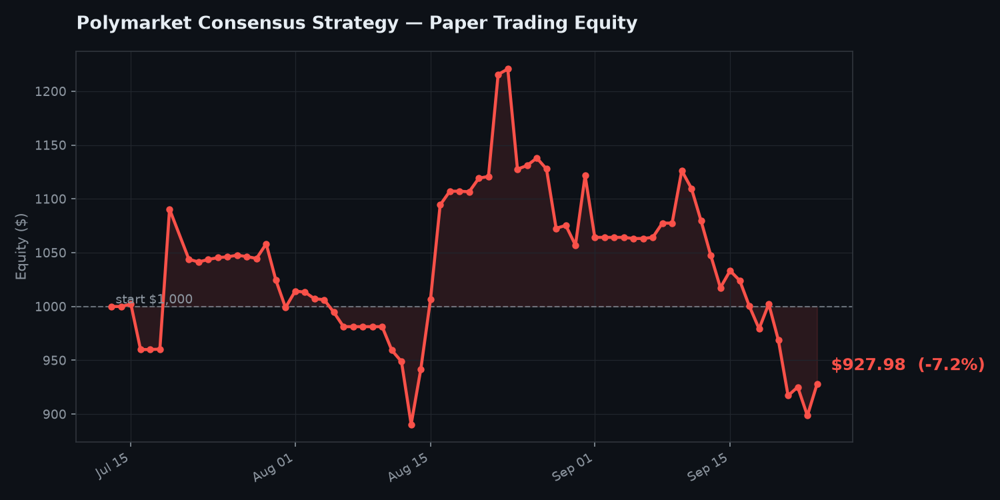

# Polymarket Consensus Trade Finder + Paper Trader

Pulls Polymarket's top traders off the public leaderboard, checks what
they're currently holding, flags markets where several of them are on the
same side, and (optionally) paper-trades that strategy over time so you can
see whether it would actually be profitable before risking real money.

Everything here is read-only against Polymarket — no wallet, no private
key, no order placement, ever.



*Updated automatically every day by `chart.py` — see "Charting performance" below.*

**Looking for the SEC insider-buying bot?** That's a separate, independent
strategy in this same repo — see [`INSIDER_TRACKER.md`](INSIDER_TRACKER.md).

**Looking for the calibration bias bot?** A third, independent strategy
that checks whether Polymarket itself is mispriced, rather than copying
traders or watching insiders — see [`CALIBRATION_BOT.md`](CALIBRATION_BOT.md).

**Looking for the weather temperature bot?** A fourth bot using Open-Meteo
meteorological forecasts to find mispriced daily temperature bucket markets
(resolves every day, fast feedback) — see [`WEATHER_BOT.md`](WEATHER_BOT.md).

## Setup

```bash
pip install requests matplotlib
```

## 0. `find_traders.py` — find more (and better-vetted) winners to follow

The leaderboard has four separate time windows (day/week/month/all-time)
plus category splits. `consensus.py` on its own only pulls one of those
slices. This script pulls *all* of them and ranks traders by how many
different leaderboards they show up on — a much stronger signal than
"biggest number right now," since a trader who only appears once might
just be riding one lucky concentrated bet.

```bash
# Pull all 4 time windows, keep traders appearing on 2+ of them
python find_traders.py

# Wider net: pull every category too (more traders, noisier signal)
python find_traders.py --categories OVERALL POLITICS SPORTS CRYPTO

# Stricter: only traders on 3+ of the 4 windows
python find_traders.py --min-appearances 3
```

This writes `watchlist.json`, which `consensus.py` and `paper_trader.py`
can use instead of a single leaderboard pull:

```bash
python consensus.py --watchlist watchlist.json
python paper_trader.py --watchlist watchlist.json
```

| Flag | Default | What it does |
|---|---|---|
| `--top-per-slice` | 50 | traders pulled per leaderboard slice |
| `--periods` | all 4 | DAY WEEK MONTH ALL (space-separated) |
| `--categories` | OVERALL | add more categories for a bigger pool |
| `--min-appearances` | 2 | keep traders on at least this many lists |
| `--watchlist` | watchlist.json | output path |

The included `.github/workflows/weekly-discovery.yml` refreshes
`watchlist.json` every Monday automatically, and the daily paper-trading
workflow will use it the moment it exists (falling back to the plain
top-50-monthly leaderboard until then).

## 1. `consensus.py` — find the trades

```bash
# Top 50 traders by 30-day PnL, show consensus trades held by 3+ of them
python consensus.py

# Top 25 by all-time volume, in the Politics category, require 5+ overlap
python consensus.py --top 25 --period ALL --order-by VOL --category POLITICS --min-traders 5

# Save full results to file
python consensus.py --csv out.csv --json out.json
```

**How it works:** hits `data-api.polymarket.com/v1/leaderboard` for the top
N traders, hits `data-api.polymarket.com/positions` for each trader's open
positions, groups by `(market, outcome)`, and flags any group with 3+
(configurable) traders as a consensus trade — ranked by overlap, then by
combined dollar size.

| Flag | Default | What it does |
|---|---|---|
| `--top` | 50 | how many leaderboard traders to pull |
| `--period` | MONTH | DAY / WEEK / MONTH / ALL |
| `--category` | OVERALL | OVERALL, POLITICS, SPORTS, CRYPTO, etc. |
| `--order-by` | PNL | PNL or VOL |
| `--min-traders` | 3 | minimum overlap to count as "consensus" |
| `--min-position-value` | 25.0 | ignore positions worth less than this |
| `--show` | 15 | how many results to print to console |
| `--csv` / `--json` | — | optional file output |

## 2. `paper_trader.py` — track if it would actually make money

Runs the same consensus logic, but instead of just printing it, simulates
trading it with fake money so you build an honest track record.

Each run:
1. **Settles** any open paper position whose market has resolved, against
   the real outcome (win / loss / push), and updates simulated cash.
2. **Scans** for new consensus trades and opens a fixed-size paper position
   (`--stake`, default $20) on any it hasn't already taken.
3. **Reports** equity, ROI, win rate, and realized P&L, and saves state to
   `paper_trades.json` so the next run continues the same simulated account.

```bash
python paper_trader.py                                    # normal daily run
python paper_trader.py --no-new-entries                   # just check standings, don't open new trades
python paper_trader.py --starting-bankroll 500 --stake 10  # smaller simulated account
```

| Flag | Default | What it does |
|---|---|---|
| `--starting-bankroll` | 1000 | simulated starting cash (first run only) |
| `--stake` | 20 | $ size per new paper position |
| `--max-open` | 20 | cap on simultaneous open paper positions |
| `--no-new-entries` | off | settle/refresh only, skip opening new trades |
| (all of `consensus.py`'s filter flags also apply) | | |

### Reading the results honestly

- **Mark-to-market, not fills.** It assumes you'd get exactly the price
  shown when a consensus trade was flagged. Real order books have spread
  and slippage, so live fills would run slightly worse.
- **No fees modeled.** Polymarket's fee schedule varies by market; this
  sim assumes zero.
- **Small sample, low confidence.** A few weeks of paper trades isn't
  enough to know if there's real edge versus noise. Give it real runway
  (months, dozens of closed trades) before drawing conclusions either way.
- **Survivorship bias still applies** to who's on the leaderboard in the
  first place — see below.
- Check the results regardless of how they're trending, not just when
  you're curious after a winning stretch.

## 3. `chart.py` — visualize whether it's actually working

Turns `paper_trades.json`'s equity history into a PNG chart instead of
making you read numbers in Discord. Green if you're up overall, red if
you're down, with a dashed line marking the starting bankroll.

```bash
python chart.py
```

The daily automated workflow runs this after every trading run and
commits `equity_curve.png` back to the repo — which is what's embedded at
the top of this README, so it stays current without you doing anything
and doubles as a shareable portfolio screenshot.

## Running it daily (automated)

`.github/workflows/daily-consensus.yml` runs `paper_trader.py` every day on
GitHub's servers and posts a summary to Discord — works even if your
laptop is off, and commits the updated `paper_trades.json` back to the repo
each run so history accumulates automatically.

**1. Create a Discord webhook** (30 seconds, no bot needed):
Discord server → channel → gear icon (Edit Channel) → Integrations →
Webhooks → New Webhook → Copy Webhook URL.

**2. Push this folder to a GitHub repo** (new or existing).

**3. Add the webhook as a repo secret:**
Repo → Settings → Secrets and variables → Actions → New repository secret
→ name it `DISCORD_WEBHOOK_URL`, paste the URL.

**4. Done.** Runs automatically at 13:00 UTC daily (~9am ET). To test
immediately: repo → Actions tab → "Daily Polymarket Consensus + Paper
Trading" → Run workflow.

There's a second workflow, `weekly-discovery.yml`, that runs every Monday
and refreshes `watchlist.json` (see the `find_traders.py` section above).
No extra setup needed — same repo, same secret, it just runs on its own
schedule. The daily job automatically picks up `watchlist.json` once it
exists.

To change the schedule, edit the `cron:` line in the workflow file
([crontab.guru](https://crontab.guru) helps with the syntax). To change
strategy parameters (stake size, min overlap, category), edit the
`python paper_trader.py ...` flags in the same file.

## Honest limitations of the underlying strategy

- **Survivorship bias.** The leaderboard ranks people *after* they got
  lucky or skilled — it doesn't tell you which. A trader who's #3 on the
  monthly PnL leaderboard because of one huge correct bet looks identical
  here to someone with a genuinely repeatable edge.
- **You're seeing positions, not reasoning.** You don't know *why* they
  took the trade, their risk tolerance, or whether they're about to exit.
- **Not all markets are available in the app** the same way they are via
  API — you may find a strong consensus trade you can't actually place.
- This is a research tool, not a guaranteed money-maker. Prediction
  markets are speculative; size real positions accordingly, and let the
  paper-trading numbers actually convince you one way or the other before
  putting real money behind it.

## Extending it

A natural next step (not included here, since it touches your wallet) is
wiring up Polymarket's CLOB API to auto-place the consensus trade for
real. That requires exporting your private key, which is meaningfully
higher-stakes than anything in this repo — worth doing deliberately, and
never by pasting the key into a chat tool.
