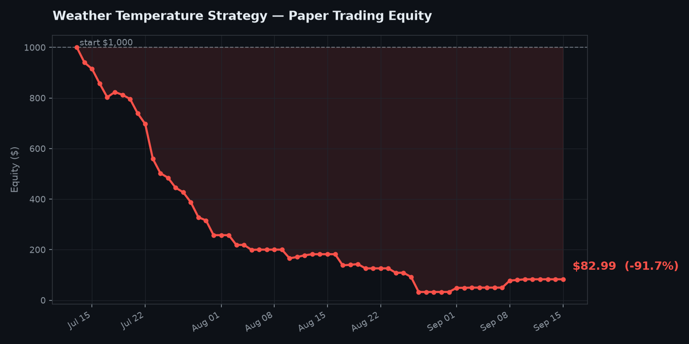

# Polymarket Weather Temperature Bot

A fourth, independent bot in this repo. Instead of copying traders, watching
insider filings, or looking for statistical miscalibration in aggregate, this
one uses **meteorological model data** to find specific temperature bucket
markets where Open-Meteo's forecast meaningfully disagrees with what
Polymarket has currently priced.



## Why temperature markets

Polymarket temperature markets ("Highest temperature in Hong Kong on June 22?")
resolve **every single day** against verified weather station data. That gives
fast feedback — you open a position and know the result within 24 hours, often
the same day. There are typically hundreds of active temperature markets
covering NYC, London, Paris, Tokyo, Hong Kong, Chicago, and more.

## The critical detail: resolution stations

Polymarket does NOT settle on city-centre temperatures. It settles on
specific airport weather stations (ASOS/METAR gauges). Paris resolves on
Le Bourget airport — which runs 1-3°C cooler than the urban core in summer.
A bot using "Paris" city-centre coordinates will systematically misprice the
top temperature buckets on every single Paris trade.

`weather_signals.py` uses a hardcoded station table from Polymarket's own
published market rules, with verified ICAO codes and exact coordinates for
every active city:

| City | Station | ICAO |
|---|---|---|
| New York | LaGuardia | KLGA |
| Los Angeles | LAX or Burbank | KLAX / KBUR |
| London | London City or Heathrow | EGLC / EGLL |
| Paris | Le Bourget | LFPB |
| Tokyo | Haneda or Narita | RJTT / RJAA |
| Hong Kong | HK International | VHHH |
| Chicago | O'Hare | KORD |
| Shanghai | Pudong or Hongqiao | ZSPD / ZSSS |

For cities with multiple possible stations (London, LA, Tokyo, Shanghai),
the bot tries to extract the ICAO code from the market's resolution rules
text. If it can't, it falls back to the primary station. Always verify
the specific market's rules before placing real money.

## How it works

1. Pulls active temperature markets resolving within 3 days from Polymarket's API.
2. Parses the city, date, and metric (high vs low) from each market title.
3. Looks up the correct station coordinates in the hardcoded table.
4. Fetches Open-Meteo's daily max/min temperature forecast for those exact coordinates.
5. Treats the forecast as a Gaussian with sigma proportional to forecast horizon
   (e.g. 0.8° for today, 2.0° for 2 days out) and computes the probability that
   the actual temperature lands in each market's bucket.
6. Flags buckets where |model probability - market price| > `--min-edge` (default 7pp).

## Setup and usage

```bash
pip install requests matplotlib

# Scan for signals only (no paper trading)
python weather_signals.py

# Run the full paper trader
python weather_paper_trader.py
```

| Flag | Default | What it does |
|---|---|---|
| `--max-days` | 3 | only look at markets resolving within this many days |
| `--min-edge` | 0.07 | minimum \|model - market\| to flag/trade (7 percentage points) |
| `--stake` | 20 | $ size per new paper position |
| `--max-open` | 20 | cap on simultaneous open positions |

## Running it automated

`.github/workflows/weather-daily.yml` runs every day at 6:00 UTC (~2am ET)
— before the US opens and before early-morning EU trading fills the books.
Add a repo secret `DISCORD_WEBHOOK_URL_WEATHER` (its own channel) and trigger
it manually once to test.

## Honest limitations

- **Station table needs verification per market.** The table is correct as
  of mid-2026 per Polymarket's published rules, but Polymarket has changed
  stations before. Always open a market's rules and verify the station before
  treating any signal as real.
- **Multi-station cities require care.** London can be EGLC or EGLL,
  depending on the specific market series. The bot tries to auto-detect via
  ICAO code in the resolution text, but this is best-effort parsing of
  unstructured text.
- **Open-Meteo is excellent but not the best model for every location.**
  For US temperature markets, NOAA's HRRR model is considered stronger
  for short-range (0-2 day) forecasts; for Europe, ECMWF IFS is often
  better than the default. Open-Meteo's `best_match` option blends
  multiple models, which is a reasonable default for a bot but not
  optimised per city.
- **The Gaussian sigma values are approximate calibrations.** Real
  temperature forecast uncertainty varies significantly by location, season,
  synoptic pattern, and model. Sigma values in the code are reasonable
  order-of-magnitude estimates, not station-specific calibrated values.
  This means the bot may be overconfident on some trades.
- **No fees modeled.** Same caveat as every other bot here.
